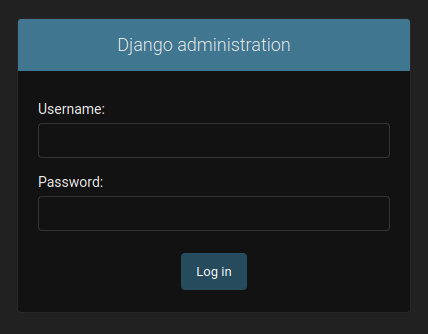
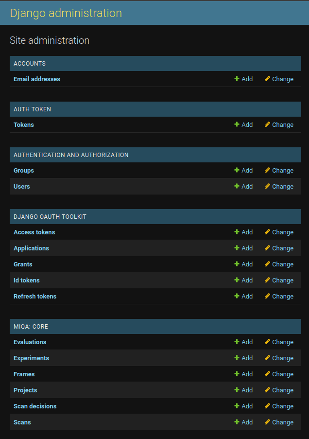

With a superuser account, an administrator can access the Django admin console as a trusted user. This interface allows the administrator to view and edit any object in the database. To access the admin console, simply navigate to the `/admin` route of MIQA in your browser. For a deployed instance, this url may look like the following: https://miqa.organization.org/admin. An admin can log in with the same credentials as on the main site.

This interface can act as a debugging method or a quick way to create, delete, or modify objects. Doing this often is not recommended; it is safer to complete such database transactions through the main MIQA interface. However, an administrator should still know about the existence of this option.

