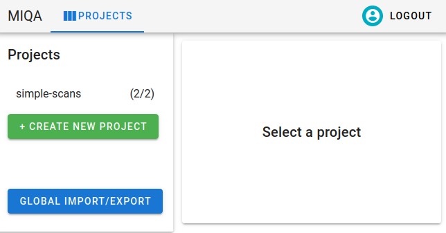
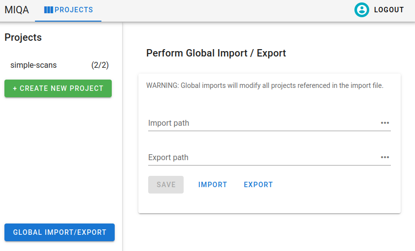

## Imports and exports

There are two ways to bring data into MIQA. The first way is uploading scans from your local computer through the MIQA web interface (see [User Guide Projects homepage](site.md#projects-homepage) for details). The second way is a system of exports and imports that catalog and refresh (respectively) the state of a project. Import files and export files reference image files on the server machine for which MIQA should save representational objects.


Before writing import files for your MIQA projects, it is important to understand the organization of certain objects in MIQA. Refer to the User Guide explanation of projects to better understand the relationships between projects, experiments, scans, and frames.


Each project in MIQA has an `import_path` and an `export_path`, which are strings that should refer to absolute file paths on the server machine. Since these attributes point to server machine files, editing these paths for a project is a privilege reserved for superusers and the creators of projects. As the system administrator for your instance of MIQA, you will be responsible for the content of these files so that normal users may successfully perform imports and exports in the application.


Additionally, you are responsible for ensuring that these files are accessible to the server (by location and permission settings). If you are running MIQA through `docker-compose`, you will need to specify an environment variable `SAMPLES_DIR` as a directory containing any absolute file paths you wish to access from the server. For example, the command `export SAMPLES_DIR=/home/user/miqa_files/` would mount the entire `miqa_files` directory to the server container and make those files available via the same absolute paths.


A project import will read the contents of the file at the referenced `import_path`, interpret that data as objects, and save those objects within the target project. An import will overwrite the current state of the project, so this operation should be performed with caution. An export will overwrite the contents of the file at the referenced `export_path` or create a new file at that location if it does not exist. The data written by an export operation will record the current state of the project, including experiments, scans, frames, and the last decision made for each scan.


The data written by the export operation is in the same format as what the import operation ingests, so it may be useful for the import and export paths for a project to be the same. In that case, an export operation would save the state of the project and an import operation would refresh that state (although any scan decisions made prior to the last decision would be lost). Adding lines to the import file before importing would add new content to the project.

### Import/export file formats

The import and export files must be in either a CSV or JSON format. Below are exact specifications and explanations for the two formats. Since only the import files are written by the administrator, these formats are explained in the context of writing import files; export files will be written in the same formats by the server.

#### Import CSVs

If your project’s import file is written in a CSV format, it should contain a header row; any following rows will represent Frame objects within the Project. Each Frame object in the Project represents a single image file. A Scan is a collection of associated Frames, and an Experiment is a collection of associated Scans. The import CSV format contains fourteen possible columns to specify things about the Frame or the Scan to which it belongs. Only the first six columns are required. Below is a list of the columns and the explanations for each.

 1. 1.  Project name. Required. In a CSV for just one project, this value should be the same for all rows in the file below the header row. This should specify the name of the project to which the Frame in this row belongs. In most cases, this is an assurance that the file is being used by the proper project. However, it is also possible to use this format to specify the objects to create in multiple projects at once, in which case the rows may have different values for `project_name` (see Global imports and exports).

2.  Experiment name. Required. Each row specifies a Frame that belongs to a Scan, which belongs to an Experiment. This column allows you to specify the experiment-level organization by specifying an experiment name for each Frame. You will likely have the same value repeated often in this column, since multiple scans are often organized into a single experiment..

3.  Scan name. Required. Each row specifies a Frame that belongs to a Scan. This column allows you to specify the scan-level organization by specifying a scan name for each Frame. You will likely have repeating values in this column.

4.  Scan type. Required. For each unique value in the `scan_name` column, some additional information about the Scan object should be supplied. The only required additional scan attribute is the `scan_type`. Other additional scan attributes can be found in columns 12-14. The scan type may be one of "T1", "T2", "FMRI", "MRA", "PD", "DTI", "DWI", or any of the ncanda-specific scan types (see miqa.core.models.scan for more).

5.  Frame number. Required. Since each row specifies a Frame belonging to a Scan in the Project, and multiple Frames can belong to a single Scan, you may specify an order for the Frames in a Scan. The `frame_number` column should contain a unique integer for each Frame in the same Scan object. If only one Frame exists in a Scan, the `frame_number` value can simply be set to 0.

6.  File location. Required. This column’s value should contain the file path of the image file to associate with this row’s Frame object. An image file should be of the types `.nii.gz`, `.nii`, `.mgz`, or `.nrrd`. This value can be an absolute file path (with the same location restrictions as for the import file itself) or a path that is relative to the parent of the import file itself.

7.  Subject ID. This is an optional additional attribute of a Scan which may be specified in the CSV. This field is stored as a string and may be a number or any other alphanumeric identifier your organization may have for scan subjects, up to 255 characters long. This value is stored in MIQA and displayed on the user interface when a scan is being reviewed. These values do not have to be unique, as multiple scans can belong to a single subject.

8.  Session ID. This is an optional additional attribute of a Scan which may be specified in the CSV. This field is stored as a string and may be a number or any other alphanumeric identifier your organization may have for session IDs, up to 255 characters long. This value is stored in MIQA and displayed on the user interface when a scan is being reviewed. These values do not have to be unique, as multiple scans can belong to a single subject.


9.  Scan link. This is an optional additional attribute of a Scan which may be specified in the CSV. As such, for each unique value in the `scan_name` column, a new value may be supplied in this column. This value should be a URL that directs to an external site where more information about that scan can be found. This link will be used in the MIQA control panel as a hyperlink on the text of the scan’s name.

10.  Last decision. As MIQA is a tool to make decisions about the usability of scans, the import/export file formats include the ability to record the last decision made on a scan. This is to enable import/export cycles where the state of a project may be saved to an export file and later redigested by the system as an import file. It is not likely that you will be writing these column values yourself, rather reading these values as the result of what the export writes. These values will be one of the following: `U` for “usable”, `UN` for “unusable”, `Q?` for “questionable”, or `UE` for “usable-extra”. If this column does not have a value for a given row, columns 11-15 will have no value either.

11.  Last decision creator. This column value will only exist when column 10 has a value. If a scan had some decision(s) made about its usability, the last one will be recorded in the last 6 columns. Column 11 specifies the user that submitted that decision.

12.  Last decision note. This column value will only exist when column 10 has a value. If a scan had some decision(s) made about its usability, the last one will be recorded in the last 6 columns. Column 12 supplies any note that the user submitted alongside the decision.

13.  Last decision creation datetime. This column value will only exist when column 10 has a value. If a scan had some decision(s) made about its usability, the last one will be recorded in the last 6 columns. Column 13 supplies the datetime on the server when the decision was submitted.

14.  Identified artifacts. This column value will only exist when column 10 has a value. If a scan had some decision(s) made about its usability, the last one will be recorded in the last 6 columns. Column 14 supplies the list of artifacts identified as present in the scan when the decision was submitted. This list will be separated by semicolons to differentiate between the column separator `,`.

15.  Location of interest. This column value will only exist when column 10 has a value. If a scan had some decision(s) made about its usability, the last one will be recorded in the last 6 columns. Column 15 supplies a three-dimensional coordinate which specifies a location of interest when the decision was submitted (or at least, what the user was looking at when they made the decision). These coordinates are slices within the three dimensional image and may be read by the MIQA webapp to bring another user to that location in the image. If a decision has a saved location of interest, a crosshair pointer icon will appear next to it in the control panel. Clicking this icon will snap the current user’s viewer to that slice location in the image.


### Examples
In the case that you only specify the required columns in your import CSV, your file may look something like this table:
|**project_name**  | **experiment_name** | **scan_name** | **scan_type** | **frame_number** | **file_location** |
|--|--|--|--|--|--|
|My Project  |Experiment 1  |Scan A  |T1  |1  |my_project/experiment_1/scan_a/file_1.nii.gz  |
|My Project  |Experiment 1  |Scan A  |T1  |2  |my_project/experiment_1/scan_a/file_2.nii.gz  |
|My Project  |Experiment 1  |Scan B  |T1  |0  |my_project/experiment_1/scan_b/file_0.nii.gz  |
|My Project  |Experiment 2  |Scan C  |T2  |0  |my_project/experiment_2/scan_c/file_0.nii.gz  |

In the case that you provide optional columns 7-9, those columns would look something like this (for the same rows as the above table).

|**…**  | **subject_id** |**session_id**  | **scan_link** |
|--|--|--|--|
|…  | sub_one | ses_one |https://my-org.org/scans/1  |
|…  | sub_one | ses_one |https://my-org.org/scans/1  |
|…  | sub_one | ses_two |https://my-org.org/scans/2  |
|…  | sub_two | ses_one |https://my-org.org/scans/3  |

After importing this version and making some decisions on these scans in MIQA, you may export the project and see optional columns 10-15 added to what you supplied. Those newly added columns would look something like this (for the same rows as the tables above).

|**…**  |**last_decision**  |**last_decision_creator**  |**last_decision_note**  |**last_decision_created**  |**identified_artifacts**  |**location_of_interest**  |
|--|--|--|--|--|--|--|
|… |U  |me@my-org.org  |  |2022-01-01 13:44:34  |normal_variants;lesions  |i=-45.504;j=-20.451;k=15.50  |
|… |U  |me@my-org.org  |  |2022-01-01 13:44:34  |normal_variants;lesions  |i=-45.504;j=-20.451;k=15.50  |
|… |UN  |me@my-org.org  |This scan is misaligned and doesn’t cover the whole brain  |2022-01-02 09:04:22  |misalignment;partial_coverage  |i=-2.669;j=-61.718;k=-48.763  |
|… |Q?  |me@my-org.org  |There may be some ghosting motion in this scan   |2022-01-02 14:02:57  |ghosting_motion  |i=50.305;j=-40.541;k=-30  |


#### Import JSONs

The information specified in the CSV format can also be specified in a JSON format. This may be more convenient/readable in the case that many frames are nested in each scan. Rather than repeating values of scan attributes for every row describing frames in that scan, the JSON format allows you to specify those scan attributes once at the scan level and specify frames in a subsequent mapping.

**Before continuing, be sure to read the above section carefully; the same descriptions apply for each of these values, though they are not repeated below.**

The example JSON below is a translation of the example CSV in the above tables to the JSON format.

```
{
    "projects": {
        "My Project": {
            "experiments": {
                "Experiment One": {
                    "scans": {
                        "Scan A": {
                            "type": "T1",
                            "subject_id": "sub_one",
                            "session_id": "ses_one",
                            "scan_link": "https://my-org.org/scans/1",
                            "frames": {
                                "1": {
                                    "file_location": "my_project/experiment_1/scan_a/file_1.nii.gz"
                                },
                                "2": {
                                    "file_location": "my_project/experiment_1/scan_a/file_2.nii.gz"
                                }
                            },
                            "last_decision": {
                                "decision": "U",
                                "creator": "me@my-org.org",
                                "note": 	"",
                                "created": "2022-01-01 13:44:34",
                                "user_identified_artifacts": "normal_variants;lesions",
                                "location": "i=-45.504;j=-20.451;k=15.50"
                            }
                        },
                        "Scan B": {
                            "type": "T1",
                            "subject_id": "sub_one",
                            "session_id": "ses_two",
                            "scan_link": "https://my-org.org/scans/2",
                            "frames": {
                                "0": {
                                    "file_location": "my_project/experiment_1/scan_b/file_0.nii.gz"
                                }
                            },
                            "last_decision": {
                                "decision": "UN",
                                "creator": "me@my-org.org",
                                "note": 	"This scan is misaligned and doesn't cover the whole brain",
                                "created": "2022-01-02 09:04:22",
                                "user_identified_artifacts": "misalignment;partial_coverage",
                                "location": "i=-2.669;j=-61.718;k=-48.763"
                            }
                        }
                    }
                },
                "Experiment Two": {
                    "scans": {
                        "Scan C": {
                            "type": "T2",
                            "subject_id": "sub_two",
                            "session_id": "ses_one",
                            "scan_link": "https://my-org.org/scans/3",
                            "frames": {
                                "0": {
                                    "file_location": "my_project/experiment_2/scan_c/file_0.nii.gz"
                                }
                            },
                            "last_decision": {
                                "decision": "Q?",
                                "creator": "me@my-org.org",
                                "note": 	"There may be some ghosting motion in this scan ",
                                "created": "2022-01-02 14:02:57",
                                "user_identified_artifacts": "ghosting_motion",
                                "location": "i=50.305;j=-40.541;k=-30"
                            }
                        }
                    }
                }
            }
        }
    }
}
```


### Global imports and exports

As an administrator, there is one more important feature to imports and exports of which you should be aware. Any import or export file has the flexibility to specify the contents of more than one project (hence the `project_name` column in the CSV format and top-level `projects` mapping in the JSON format). With global imports/exports, multiple projects can be imported/exported at once.


Only superusers have permission to perform global imports and exports. As a superuser, the Projects homepage will have an additional button at the bottom, “Global import/export”.



Clicking this button will open an interface that is similar to a project configuration, except only the import/export component is visible. You may specify and save the global import and export paths. These values, just like project import and export paths, should be absolute file paths referencing existing files on the server machine.



After saving these values, clicking “Import” will overwrite the states **of all projects listed in the file** with the objects (experiments, scans, frames, and decisions) specified in the file for that project. **This action may be destructive of the states of multiple projects, so it should be used with caution.**

Global exports, however, are non-destructive. Clicking “Export” will write the current states of all projects to the specified global export path. Just like project imports and exports, the output of the export can be used as the input of the import. It is recommended that you save the states of all projects with the global export **before** performing any global imports.
