## Site navigation
### Projects homepage
Projects are the top-level organizational structure in MIQA; as such, the homepage allows users to navigate through projects and view the status of scans within. The screenshot on the right shows a homepage view to a new user who has not been granted access to any existing projects. This user may ask to be added to existing projects or create new projects.

**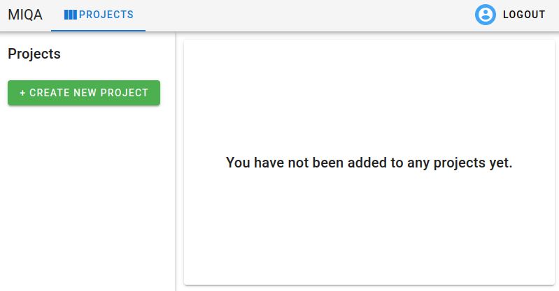**
#### Creating a project
**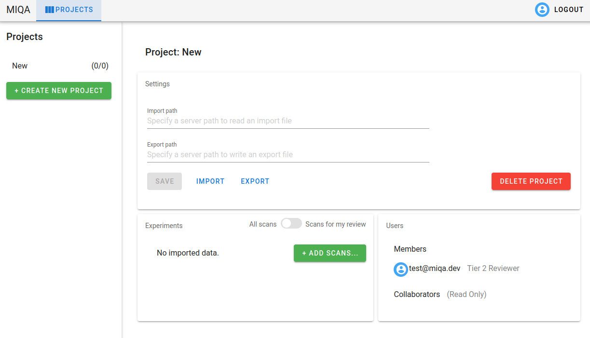**

When the “Create New Project” button is clicked, the user will be prompted for a name. After this is provided, the page will populate with an empty project. This project can be deleted at any time by the creator or by a superuser with the “Delete Project” button. From this point, the project creator has two options to add content to the project: 1) Provide an import path and an export path which point to file locations on the server machine then click the “Import” button (see [Projects > Imports and exports](./projects.md#Imports-and-exports) for details) or 2) Click the “Add Scans” button to create new experiments and supply local image files to those experiments.

**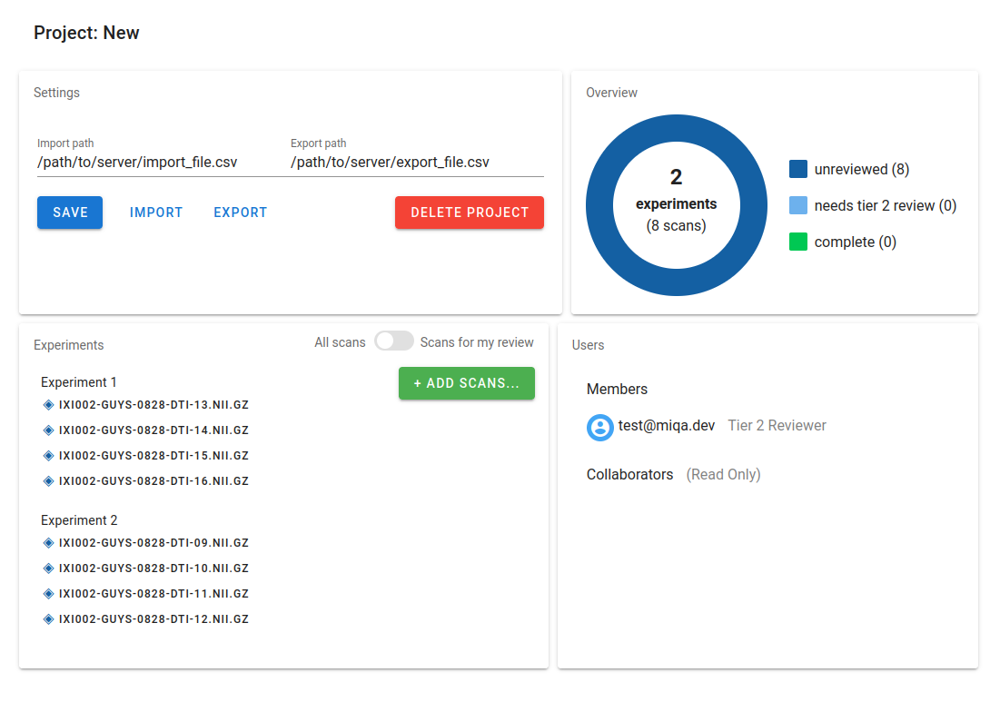**
#### Project page components
Once a project is populated with experiments and scans, the project page will have the above layout with four components (left to right):

1.  *The project’s settings*. This component allows privileged users (superusers and the project creator) to save changes to the import path and export path and delete the project. Other users (members and collaborators on the project) can perform imports and exports with those respective buttons (see Projects > Imports and exports for details).

2.  *The project overview*. This donut chart shows the status of the scans in the project. As reviews are made on these scans, the status of the scans will change, and refreshing the page will fetch the updated version of this chart. The goal of any MIQA project is to review all scans, so this illustration helps to track progress towards that goal.

3.  *The experiment list*. This component lists all scans in the project, organized by experiment. Clicking on any of the scans in this list will direct the user to the scan viewing page. This component also allows users with write access (superusers, the project creator, and members) to add scans to the project, either to existing experiments or new ones. The toggle in the upper right corner of this component switches between two modes. The default mode is viewing all scans in the project. Reviewers may wish to toggle to the second mode, which will filter the scan list such that it only shows scans in a state requiring their review (for tier 1 reviewers, this mode will show only unreviewed scans; for tier 2 reviewers, this mode will show only scans needing tier 2 review). Once this mode is toggled, a scan in the list may be chosen and the user will be directed to the image viewing page with only the filtered list of scans queued up.
4.  *The users added to the project.* This component allows privileged users (superusers and the project creator) to grant or revoke access to users. Users can be added to the list of collaborators or the list of members as either a tier 1 reviewer or a tier 2 reviewer.
**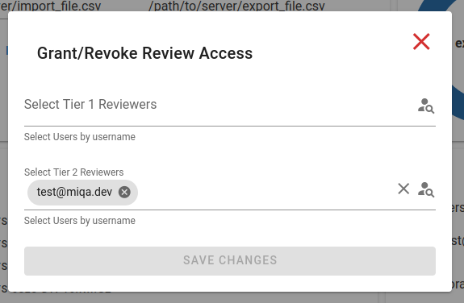**

### Scan viewing page
**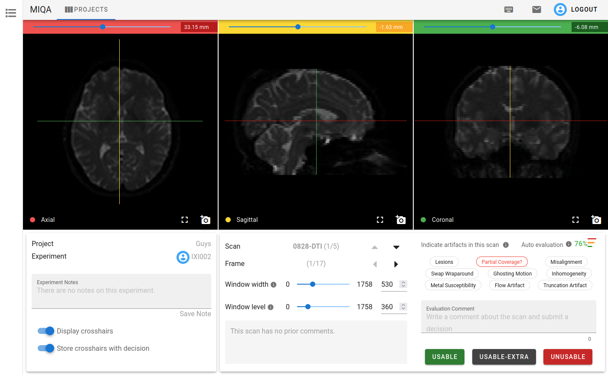**
When any scan is selected from the experiments list for a project, the user is directed to the scan viewing page, where they may view the contents of images associated with that scan.

#### Three image viewers
**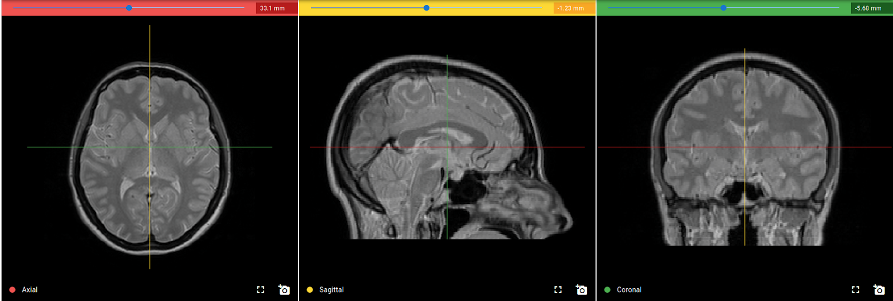**
The scan viewing page allows users to examine the contents of each frame’s image file with three viewers that each show one of three axes. By default, these axes are “axial”, “sagittal”, and “coronal”. When the mouse is over one view, several actions are available to the user to manipulate the rendering.

1.  Scrolling the mouse will change the slice location along that axis. This action is the same as using the slider above each viewer. Changing the slice on one viewer will affect the location of the corresponding crosshair in the other two viewers. For example, scrolling towards the top slice in the Axial view will bring the red horizontal crosshairs in the Sagittal and Coronal views towards the top of the skull.

2.  Clicking and dragging the mouse within one viewer will change the window width and window level of all three renderers. This action is performed across all three renderers so that these values are kept consistent for all three. Changing the window width and window level of the renderers will change the contrast and brightness of the images and make certain types of tissue more or less visible.

3.  Holding `Ctrl` or `Alt` and performing a click-and-drag within one viewer will zoom in and out on the one viewer.

4.  Holding `Shift` and performing a click-and-drag within one viewer will pan around the image in the one viewer.

5.  Clicking the camera icon in the lower right corner of each viewer will capture the state of the viewer in a 512 x 512 screenshot and open a dialog. This dialog (shown to the right) will display the captured screenshot and its filename. The user may either download this as a PNG or JPG file or attach this image to the email draft available next to the logout button (see below section, [Additional items on the scan viewing page](#Additional-items-on-the-scan-viewing-page) for details about the email feature).
 **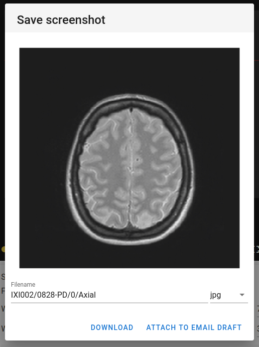**

6.  Clicking the full screen icon next to the camera icon in the lower right corner will expand the rendering of one view to use the whole window so that the image can be viewed in more detail.

#### Control panel
Below the three image viewers on the scan viewing page, there is a control panel for the user to manipulate the viewers and view contextual details about the scan. Users with a reviewer role may also save decisions about a scan in the control panel.

**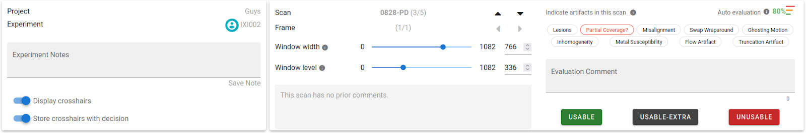**

The first portion displays the project and experiment information, including any notes taken about the experiment. It also contains toggle buttons relating to the crosshairs shown on the viewers. Turning “display crosshairs” off will remove the crosshairs from the renderings. The second toggle, which is on by default, controls whether the current slice location (as indicated by the crosshairs) is stored with a decision when it is submitted. If this control is off, no location information will be saved with a decision. If this control is on when a reviewer saves a decision, others may view where in the image the reviewer was looking when they submitted their decision.

The second portion displays the current scan and frame information, including arrow buttons to navigate to previous and next scans and frames. Using the up and down arrow buttons or arrow keys navigates to the previous and next scans in the experiment. Using the left and right arrow buttons or arrow keys navigates to the previous and next frames in the scan. If there is only one frame in a scan, the left and right buttons are disabled. This portion of the control panel also includes finer controls for the window width and window level of the three renderers, as well as a section to view the previously submitted decisions and comments for the current scan. See [Referencing others’ decisions](#Referencing-others%27-decisions) for details.

The third portion is solely for users who have permission to save decisions for scans in a project (superusers, the project creator, and reviewers). This section is blank for collaborators, who cannot save scan decisions. See [Saving a decision](#Saving-a-decision) for details.

**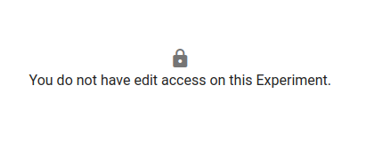**

##### Exclusive edit access for an experiment
**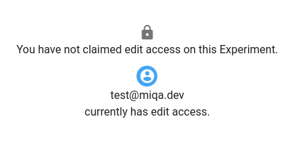**

To ensure that no two reviewers are submitting decisions on the same experiment at the same time with risk of one overwriting the other’s work, edit access for an experiment must be claimed by one user at a time. This means if one reviewer is currently working with an experiment, a second reviewer will not see the usual contents of the third portion of the control panel, instead seeing the image to the right. If an experiment is currently locked by a user, that user’s icon will appear next to the experiment name where it appears in the experiment list and the first portion of the control panel.

**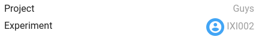**

##### Saving a decision
**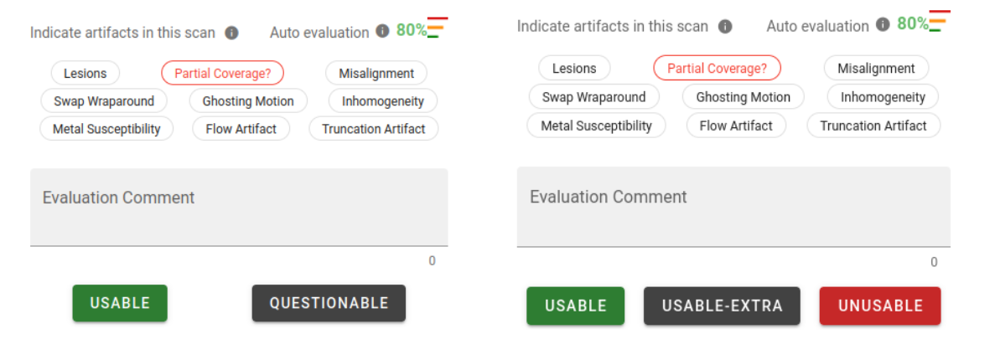**

The third portion of the control panel is dedicated to saving decisions for a scan. Tier one reviewers will have the options “Usable” or “Questionable” (shown on the left), whereas tier two reviewers will have the options “Usable”, “Usable-extra”, or “Unusable” (shown on the right). All reviewers may leave a comment with their decision on a scan; comments must be supplied for any decision that is not “Usable”.

All reviewers may also specify the presence or absence of certain artifacts in the scan with a set of tags. This allows for specificity about faults in scans in a standardized manner. Clicking a tag once fills the tag red to indicate that the artifact is present in the scan. Clicking it once more crosses through the text to indicate that the artifact is absent. Clicking the tag a third time will put that tag back in an unspecified state. When the tag is not specified as either present or absent by the reviewer, it will appear either as normal black text or it will appear as red text with a question mark when the last evaluation suggests that the artifact may be present. The last evaluation may either be a previous decision by another reviewer or the automatic evaluation provided by the neural network on the server (see [Referencing the automatic suggestion](#Referencing-the-automatic-suggestion) for details). This state (shown on the “partial coverage” tag in the above example) is only a suggestion, and only the filled red tags are saved as “present” artifacts. Clicking the suggestions to fill them red will confirm that the user agrees with the suggestion, whereas clicking the suggestions twice to cross through the text indicates that the user disagrees with the suggestion. Leaving them in the suggested state is neither a statement of agreement nor disagreement.

**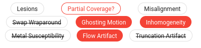**

##### Referencing the automatic suggestion
**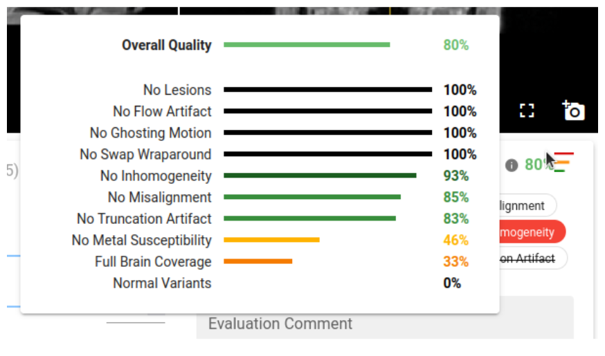**
MIQA comes with a built-in neural network and automatic suggestion feature that will inform reviewers about possible faults in a given scan. These automatic evaluations are run when scans are imported into a project. The neural network returns confidence values pertaining to the presence of the nine scan artifacts, as well as an “overall quality” metric for the scan derived from the nine confidence values and a metric for the presence of normal variants in the scan. The results of the automatic evaluation are used to suggest the presence of the nine artifacts to reviewers of the scan (see [Saving a decision](#Saving-a-decision) for details). The full results of the automatic evaluation are available by hovering over the auto evaluation icon (displayed as three bars, as shown to the right) above the artifact selection tags in the control panel. In the example on the right, the “full brain coverage” confidence score is low (below 40%), so the automatic evaluation will suggest that the “partial coverage” artifact is likely present in this scan (as seen in the above section).

##### Referencing others’ decisions
Once one decision has been saved for a scan, future reviewers may wish to take this evaluation into account on their own decision. As such, all previous decisions made on a scan are available in the middle portion of the control panel.

**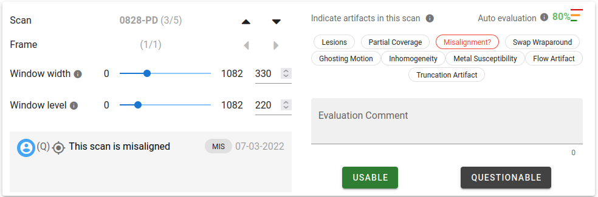**

In the above example, a previous reviewer marked this scan as “Questionable”, marking that the “misalignment” artifact was present and including a comment to explain the decision. Notice how the “misalignment” artifact tag is now suggested to the current reviewer.

****

The previous decisions displayed in this box are shown in reverse chronological order, with the most recent decision on top. Each row in this display represents a decision saved by a reviewer, and there are several parts to each row:

1.  *The user icon*. This is the icon of the reviewer that submitted the review. Hovering over this icon will display the username of this reviewer.

2.  *The decision in shorthand*. If the reviewer decides that the scan is “unusable” the shorthand will be a red “(UN)”. If the reviewer decides that the scan is “usable” the shorthand will be a green “(U)”. “Questionable” is displayed as a gray “(Q?)”, and “usable-extra” is displayed as a gray “(UE)”.

3.  *The crosshairs icon*. If the reviewer had the “Store crosshairs with decision” option enabled when they saved their decision, the crosshairs icon will appear with the decision. Clicking this icon will change the slices shown in the three viewer components such that the user sees where in the image the reviewer was looking when the decision was saved. This enables reviewers to make comments about a specific part of the image for others to consider.

4.  *The comment*. This text is the comment made with the decision. If a reviewer marks a scan as “usable”, a comment is not required.

5.  *The present artifact tags*. These tags display the shorthand (the first three characters) of the artifact tags that the reviewer marked as present. These tags will be suggested to the next reviewer. Hovering over the tag will display the full name of the artifact.

6. *The date*. This is the date on which the decision was saved.

#### Additional items on the scan viewing page
1.  *The context sidebar*. The left edge of this page includes a sidebar that expands upon hovering. This sidebar shows the same content as the experiments list on the project page. This acts as a navigational tool as the user continues down the list of scans in each experiment. The user’s icon will be shown next to the experiment they are currently viewing to represent that they have exclusive edit access (see Control Panel > Exclusive edit access for an experiment for details). Clicking any scan in this list will bring the user to that scan. Note that the review mode toggle exists here, too, so the user may filter/unfilter the queue of scans to flip through.

    **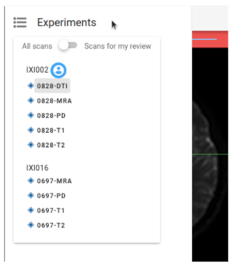**

2. *Additional toolbar items.* The toolbar at the top includes a link back to the projects page, as well as the logout button, user information, and two additional buttons only visible on the scan viewing page:
**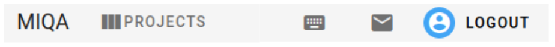**

	a. *The keyboard shortcuts dialog*. The keyboard icon opens a simple dialog with a table describing all the keyboard shortcuts available for use on the scan viewing page.

	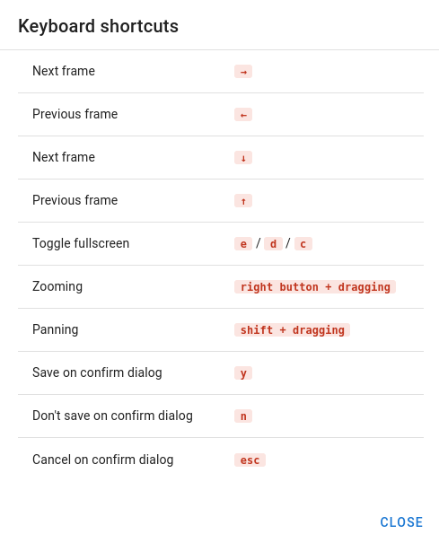

	b. *The email draft dialog*. The envelope icon opens a dialog that allows the user to draft an email to a colleague in regards to the current scan. This is especially useful in combination with the screenshot feature on the three image viewers (see previous section). A user can attach multiple screenshots of the scan to a single email draft.

	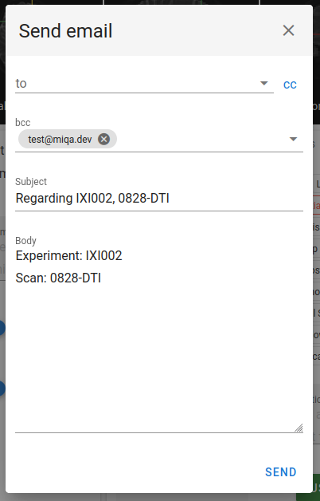
