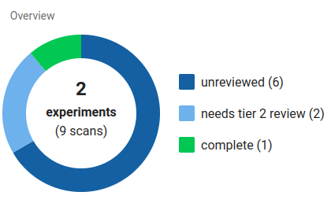

## Users
### Signing up
****
The MIQA login screen has a button in the upper right corner that allows new users to request an account. This button leads to a form where a new user can provide their email address and write a new password for their account. After submitting this form, a verification email will be sent to the email address that was provided. The new user must click the verification link in this email to verify their identity.

Once the email verification process has been completed, a second email will be sent to the MIQA administration (all users with “superuser” status) requesting manual account activation on behalf of the new user. A new user of MIQA will not be able to log in until an administrator activates the new account. This process ensures  that the data on any instance of MIQA is only made available to trusted persons.

### User roles
At the global level, a user is either a normal user or a “superuser” with heightened privileges and additional responsibilities. Superusers should be trusted individuals, as they are given the following privileges:

1.  Edit the import path and export path on projects

2.  Perform imports and exports on projects

3.  Delete projects

4.  Grant/revoke project roles to/from other users

5.  Automatically have at least tier 1 reviewer privileges on every project

6.  Claim edit access on any Experiment (as long as the experiment is not currently being edited)

7.  Approve the accounts of new users once the email for that new account has been confirmed

**Superusers have the responsibility to upkeep the MIQA instance and resolve any issues that may arise.** Normal users may sometimes rely on the action of superusers, so it is important that the identities of the superusers are known to normal users such that superusers may be contacted in case of issues.

In addition to a user’s global role, each user may be assigned a role per project. Projects are the basic organizational structure in MIQA that act as buckets for data separation; this is how protected data can stay private to a group of selected users. The data in a project can only be seen by users explicitly added to that project (and superusers, implicitly). A user can be added to a project with read-only permission (as a collaborator) or with read-write permissions (as a member). Collaborators cannot edit notes or submit reviews of scans, but they may view the data in the same manner that members can. Members have the ability and responsibility to submit reviews of scans in the project until a final decision has been made on every scan in the project.

The group of members on a project has a two-tier structure to encourage cooperation on decisions and enforce that final decisions are only made by knowledgeable reviewers. Tier 1 reviewers enact a first round of review, marking scans as either “usable” or “questionable.” Tier 2 reviewers are entrusted to make a final decision on questionable scans by marking them as either “usable,” “unusable,” or “usable-extra.”

A scan is considered "unreviewed" when no decisions exist for that scan; it is not considered "complete" until a decision has been made by a tier 2 reviewer. If a scan only has decisions made by tier 1 reviewers, it is considered as "needs tier 2 review".

****

**NOTES**

>If a project has no need to differentiate between reviewer tiers, simply set all reviewers as tier 2.
	All Projects implicitly include all superusers as tier 1 reviewers, since superusers automatically have edit permissions on every project.
	Normal users will not be able to view or interact with a project's settings (i.e. importing and exporting features).
